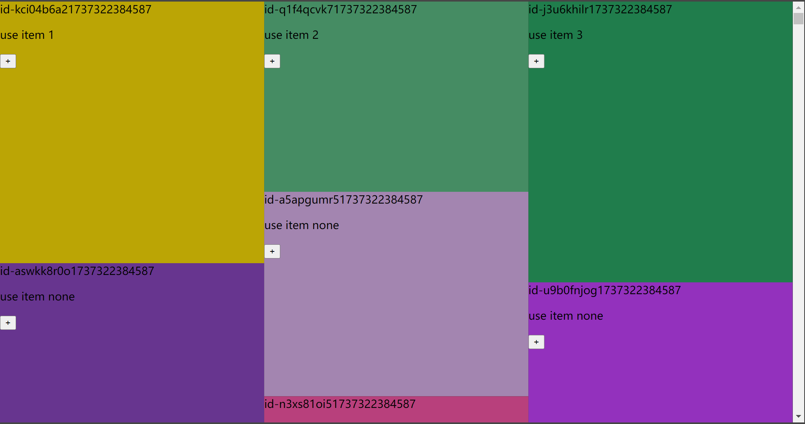

# XCN Virtual Waterfall


一个简单的定宽不定高虚拟列表瀑布流组件，使用`react + ts`编写，适用于`react`项目



## Feature

- [x] 支持虚拟列表
- [x] 自定义列数
- [x] 响应式
- [x] 支持自定义底部元素
- [x] 支持指定挂载滚动监听的容器
- [x] 支持使用钩子动态更改单个项目渲染
- [x] 支持使用钩子触发重新布局
- [ ] (待开发)根据宽度动态调整开关，适合停止滚动，宽度归0的场景

## Usage

### 1. Install

```shell
npm install xcn-waterfall
```

### 2. Import

```tsx
import {useXCNWaterfallItem, XCNWaterfall} from "xcn-waterfall";
```

### 3. Use

#### 父组件使用示例

```tsx
// src/example/responsiveCols.tsx

function ResponsiveCols() {
  // 这里随机生成一些盒子
  const [data, setData] = useState(
    generateRandomObjects().map(item => {
      const id = generateRandomId()

      return {
        id: id,
        height: item.height,
        width: item.width,
        content: () => (
          <Comp
            name={id}
            style={{
              position: 'absolute', left: 0, top: 0, right: 0, bottom: 0,
              background: item.color
            }}
          >
          </Comp>
        )
      } as WaterfallItems // 这个类型定义了每个item的必要参数，包括id，height，width，content
    })
  )
  
  // 这里是处理 onRequestBottomMore 事件，当请求3次后，返回空[]表示没有更多数据了
  const count = useRef(0)
  const handleRequestMore = async () => {
    count.current++
    let newData: WaterfallItems[] = []

    if (count.current < 3) {
      newData = generateRandomObjects().map(item => {
        const id = generateRandomId()
        return {
          id: id,
          height: item.height,
          width: item.width,
          content: () => (
            <Comp
              name={id}
              style={{
                position: 'absolute', left: 0, top: 0, right: 0, bottom: 0,
                background: item.color
              }}
            />
          )
        }
      })
    } else {
      newData = [];
    }

    // 延时 1000 ms
    await new Promise(resolve => setTimeout(resolve, 1000))

    return newData as WaterfallItems[]
  }

  return (
    <>
      <XCNWaterfall
        data={data}
        // 响应式列数，指定在不同屏幕下的列数
        columnsGroup={{
          xs: 1,
          sm: 2,
          md: 3,
          lg: 4,
        }}
        // 容器滚动监听的ref，可选，默认自动生成100%高度的容器包裹自身滚动
        // scrollContainerRef={scrollRef}
        onRequestBottomMore={handleRequestMore}
        // 底部元素渲染函数，可选
        bottomCompRenderFn={(reqCount: number, isLoading: boolean, isFinished: boolean) => (
          <h4 style={{
            color: 'yellow',
            textAlign: 'center'
          }}>waterfall bottom | reqCount {reqCount} | isLoading {`${isLoading}`} | isFinished {`${isFinished}`}</h4>
        )}
        // 容器样式，可选
        style={{
          width: '80vw',
          height: '80vh'
        }}
      />
    </>
  )
}
```

#### 子组件使用示例

```tsx
// src/example/comp.tsx
// 自定义的卡片
export function Comp(props: any) {

  // 通过 useXCNWaterfallItem 获取到当前卡片的 item 数据，并修改并重新渲染该卡片
  const {
    item, updateItem,
    initState, computedPosition, computedItemsInView, setItemsToRender
  } = useXCNWaterfallItem(props.name)

  /**
   * update new width and height for box
   * */
  const updateNewBox = () => {
    updateItem({
      height: Math.floor(Math.random() * (1024 - 512 + 1)) + 512,
      width: Math.floor(Math.random() * (1024 - 512 + 1)) + 512,
    })
    initState()
    computedPosition()
    setItemsToRender(computedItemsInView())
  }

  return (
    <div {...props}>
      {props.name}
      <p>
        use item {item?.count || "none"}
      </p>
      <button onClick={() => {
        if (!item?.count) {
          updateItem({
            count: 1
          })
        } else {
          updateItem({
            count: item.count + 1
          })
        }
      }}>
        +
      </button>
      <button onClick={updateNewBox}>
        set new box
      </button>
    </div>
  )
}
```

### Tips

- 使用`useXCNWaterfallItem`钩子动态更改单个项目渲染，比如单个卡片内的计数器
- 优先使用`columnsGroup`属性设置列数，如果没有该属性，则使用`columns`属性，响应式是基于容器宽度而不是window宽度

### Full Example

可查看`src/example`目录

## Props

[接口参数](src/packages/xcn-waterfall/interface.ts)

## License

[MIT](LICENSE.txt)
